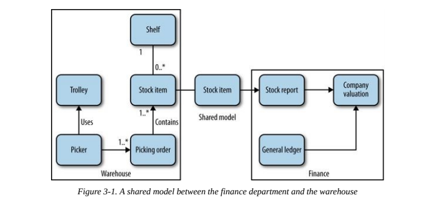

# How to model services

What makes a good service? The whole point of microservices is the ability to deploy them independently, so **loose coupling** and **high cohesion** (same kind of logic not distributed across different microservices) are needed.

Let's introduce the fictional domain of MusicCorp, an old company who wants to sell music tapes online.

## The Bounded Context

Bounded context is a concept introduced in DDD (*Domain Driven Design*). A bounded context has private and public models relative to a domain context. Only public models are exposed to other contexts. Also, public models can be a different representation of private models (they can be *mapped* models).

This allows for both loose coupling, since there are no references to whole models, and high cohesion, since these contexts are modeled from actual domain contexts.

For example, in the MusicCorp online business, *Warehouse* and *Finance* are different bounded contexts.

Here *Stock item* is a public model shared by each context which has different representations in each context.

The benefits provided by bounded contexts makes them really good candidates to be microservices.

But be careful: restructuring bounded contexts has a high cost, so architects must not fall into the **premature decomposition** trap. If you have a solid understanding and vision of the whole system, your bounded contexts will be solid. Otherwise, you may need to reorganize them frequently.

### Nesting

It's best to think first about coarse-grained bounded contexts. Then these usually can be further divided into subcontexts. Should you keep the nested contexts public or private to the parent context?
Usually, if each subcontext has a respective team that handles that area in the organization, it's ideal to make each subcontext public (thus an effective context).