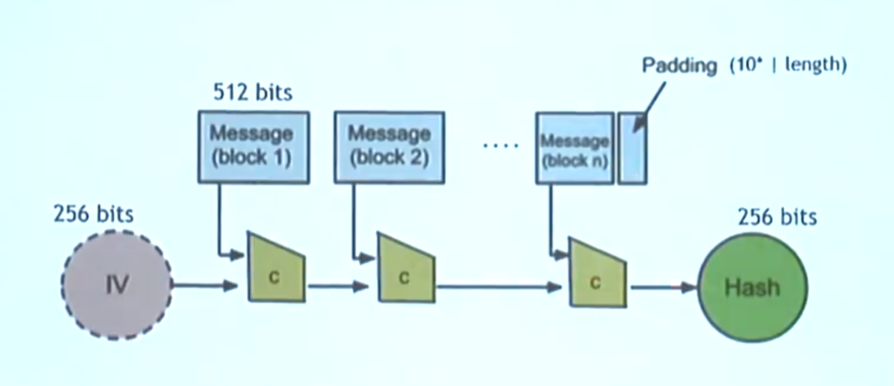

# Hash function

A function that maps a string to a fixed size output.

*H(x): x string -> fixed size output*

## Properties

### Collision-free

It's hard to find a collision.
Note that no hash function has ever been formally proved to be collision-free.

###### Application

**Message digest:** if *H(x) = H(y)* then it's safe to assume that *x = y*. This means that hash functions can help verify the integrity of documents without scanning the whole document.

### Hiding

Given *H(x)*, it's hard to find *x*.

###### Application

**Commitment problem:** we want to commit to value and reveal it later to an audience. If we hash that value, thanks to this property, we know that it will be hard for attackers to correctly guess it before we chose to disclose it. While our audience also knows that we wouldn't be able to change the committed value because hash functions are collision-free: it would be infeasible to generate a collision with the value we picked.

### Puzzle-friendly
Given a puzzle *id* and a target set *Y*, try to find a solution *x* such that *H(id | x) is in Y*.
Puzzle-friendly means that, for the stated problem, no solving strategy is much better that trying random values of x.

###### Application

**Crypto puzzles:** puzzles that can be used as proof of work. These puzzles are used in blockchain based coin technologies such as Bitcoin.

## Hash function examples

## SHA-256

A popular hash function.
A high level description of SHA-256 is given by the following diagram:

