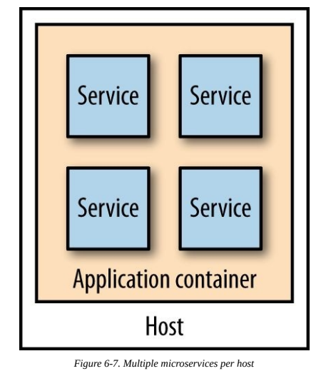
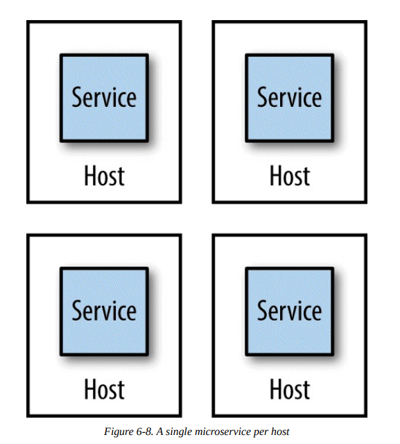
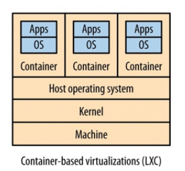

# Deployment

Deployment in microservices differs from monolithic systems. It's important to have a working approach following the continuous integration and delivery practices.

## Mapping Continuous Integration to Microservices

The goal is to be able to deploy microservices independently.
So, how to map microservices to builds and code repositories? We have different options:

### Single repository and single build

Use a single repository to store all our code, and have a single build, triggered on every code integration, that produces every build artifact we need.

Benefits:

- Easy to implement.
- Easy to commit changes.

Downsides:

- A small change to a single service will trigger builds we do not need.
- What services do we need to deploy? Hard to determine which services changed by only looking at the pushed commit.
- If a commit breaks the build, the build needs to be fixed before any other team can push code in the repository, locking those teams.

### Single repository and multiple builds

A variation of the previous approach is to have a single repository but setup multiple CI builds mapping to parts of the source code.

Benefits:

- Easy to commit changes.

Downsides:

- Developers can get into the habit of making changes to different services in the same commit.

### Multiple repositories and multiple builds

Each microservice has its own repository and CI build.

Benefits:

- Only needed builds and tests are run when the build is triggered.
- A team can own the repository that it's working on.

Downsides:

- Making changes across microservices is more difficult, but this is still preferable to the single repository approach.

## Build Pipelines and Continuous Delivery

In build processes usually there are a lot of fast, small-scoped tests, and a few large-scoped, slow tests. We will not get fast feedback when our fast tests fail if we're waiting for the other tests to finish. Also, if the fast tests fail, there is no need to run other tests.

A solution to this problem is to have different stages in our build, i.e. a **build pipeline**.
Build pipelines allow to track the software as it goes through each build stage, giving a clear idea of its stability.

In *continuous delivery* (*CD*) we get constant feedback on the production readiness of each and every check-in, and treat each and every check-in as a release candidate. So clearly *CD* benefits from build pipelines.
In microservices with CI, we want one pipeline per service, in which a single artifact will move through our path to production.

## Exceptions to Continuous Delivery

In the starting stage of a project, a single repository and single build approach may be more convenient since developers are not confident with the domain yet because the service boundaries are likely to change a lot. In this case, having a multi repository model will increase a lot the cost of these changes.
Then, when the development team acquires experience in the domain, it can start moving out services in their own repositories and build pipelines.

## Platform-Specific Artifacts

Some artifacts are platform-specific (e.g. JAR files). This means that they need a specific configuration and a specific platform to be run in an environment.
Tools like [Puppet](https://puppet.com/) and [Chef](https://www.chef.io/) can help to automate this process.

## Operating System Artifacts

Another option for platform-specific artifacts is to use os-specific artifacts. This way, the OS can manage dependencies, installation and removal of your software.

The downside is in actually creating these packages, because the difficulty depends on the target OS (e.g. teams using Windows, not known for package management capabilities, may be unhappy with this approach).

Another downside is that if you need to deploy on different OS, there is an increase in complexity in your build and test process.

## Custom images

The problem with tools like Puppet and Chef is that **they take time to provision a machine**. They need to install platforms (e.g. JVM) or perform expensive checks on the system to detect if a valid platform version is already installed.

And if we're using an on-demand compute platform we might be constantly shutting down and spinning up new instances frequently, making the time cost of these tools really high.

If you need to install the same tools multiple times per day (e.g. because of CI) this becomes a real problem in terms of providing fast feedback. It can also lead to increased downtime when deploying in production if your systems do not allow zero-downtime deployment (*blue/green deployment* can help mitigate this issue).

One approach to **reducing the provisioning time** is to create a virtual machine image that bakes in some common dependencies we use. When we want to deploy our software, we spin up an instance of this custom image, and all we have to do is install the latest version of our service.

When you launch new copies of this image you don't need to spend time installing your dependencies, as they are already there. This can result in significant time savings.

There are drawbacks too:

- Build times are increased.
- Resulting images can be very large, making it hard to move them across the network.
- The image build process differs from platform to platform (e.g. VMWare images, Vagrant images).
  Tools like [Packer](https://www.packer.io/) can help.

As we'll see later, container technology mitigates these drawbacks.

### Images as Artifacts

Why stop at including only dependencies in these images? We can also include our software in it.
This will make our software platform agnostic and it is a good way to start implementing the *immutable server* deployment concept.

### Immutable Servers

To keep our servers immutable we also must be sure that no one is able to access them after they've been deployed (e.g. by disabling *SSH* in the image artifact).
Otherwise, the configuration could be edited, causing a *configuration drift*.
If we want to have environments that are easy to reason about, every configuration change must pass through a build pipeline.

## Environments

Our microservice artifact will move in different environments during the CD pipeline.
Usually these are:

1. Slow tests environment.
2. UAT environment.
3. Performance/load test environment.
4. Production environment.

As you go on in the pipeline, you want the environments to look more like the production environment, allowing to catch production problems before they happen in production.
But consider that production environments are more expensive and slower to set up. So you should balance the ability to find production-like bugs with the ability to get fast feedback from builds.

## Service configuration

Our services need some configuration (e.g. db username and password). Ideally this should be a small amount of data. Also, it's best to minimize configuration that changes between environments, so that you minimize chances for environment-specific bugs.
But how to handle this kind of configuration?

- Bundling the configuration in your build artifacts is to be avoided because it violates the principles of *CD*.
  In this case it would be hard to avoid having sensitive data (e.g. passwords) in your source code.
  Also, build times are increased since you now have more images.
  Then you have to know at build time which environments exist, coupling the build process with the delivery process.
- Create a single artifact and place configuration files in environments or use a dedicated system for providing configuration (a popular approach in microservices).

## Service-to-Host Mapping

In this era of virtualization, the mapping between a single host running an operating system and the underlying physical infrastructure can vary a lot.

Let's define *host* to be the generic unit of isolation, i.e. an operating system onto which you can install and run your services.

So how many services per host should we have? There are different options.

### Multiple Services Per Host

Having multiple instances of your service per host.

Benefits:

- Simpler work for the team that manages the infrastructure.
- Using host virtualization can add overhead and thus increase costs.
- Easier for developers to deploy: a deploy with this setup works like a deploy to a dev machine.

Downsides:

- Make monitoring more difficult (e.g. monitor the host CPU usage or each instance?).
- Causes side effects (e.g. when a service is under heavy load, it's likely some other service instances will slow down too).
- Need to ensure that a service deployment does not affect other services on the same host.
  Usually this is solved by deploying all service in one step, thus losing ability to deploy independently.
- Autonomy of teams is inhibited in case services of different teams are deployed to the same host.
- Cannot deploy images and immutable servers.
- It can be complicated to target scaling at a service in a host.
- If a service handles sensitive data or has different needs (e.g. another network segment), you cannot deploy it with the others.

### Application Containers

Use an application container (e.g. IIS or Java servlet container) that provides utilities such as management, monitoring and scaling of services.

Benefits:

- Has too for managing monitoring, scaling and other aspects.
- If all services require the same runtime, this approach reduces overhead (e.g. for *n* Java services only a single JVM instance is needed).

Downsides:

- Technology choice and tools that automate services management are constrained. Losing automation here means having to do a lot of work in managing services.
- Usually slow spin-up times, slowing feedback for developers.
- Analyzing resources use is hard, as you have multiple applications sharing a single process.
- Application containers have their own resource consumption overhead.

### Single Service per Host

A host contains only a single service.

Benefits:

- Easier to monitor resources usage.
- Easier to avoid the side effects of having multiple services in a single host.
- Reduces complexity of your system.

Downsides:

- More hosts mean more servers to manage and costs might increase.

You can mitigate the complexity of managing more hosts by using a **platform as a service** (PaaS). This way, the host management problem is simplified, but you lose control over your hosts.

*Tip: some PaaS try to automate too much (e.g. automate scaling), making them less effective for your specific use case.*

## Automation

Automation is the solution to many of the problems we have raised so far.

One of the pushbacks for switching to single service per host is the perception that the amount of overhead for management will increase. If you do everything manually, it surely will, but automation will prevent this issue.

Automation also allow developers to be productive, especially if they have access to the same technologies used in production because it will help catch bugs early on.

Embracing a culture of automation is key if you want to keep the complexities of microservice architectures in check.

## From Physical to Virtual

One of the key tools available to us in managing a large number of hosts is finding ways
of chunking up existing physical machines into smaller parts.

### Traditional Virtualization

Having lots of hosts can be really expensive if you need a physical server per host. By virtualizing you can split a physical machine in separate parts but of course this comes with an overhead.

For example, in *Type 2* virtualization, the *hypervisor* sets aside resources for each virtual machine it manages, but these resources could be used for something else instead of being idle and reserved.

#### Vagrant

A deployment platform usually employed for development and testing. It allows to define instructions about how to setup and configure VMs. This makes it easier for you to create production-like environments on your local machine.

One of the downsides is that if we have one service to one VM, you may not be able to bring up
your entire system on your local machine.

### Linux containers

Linux containers, instead of using an hypervisor, create a separate process space in which other processes live.

Each container is effectively a subtree of the overall system process tree. These containers can have physical resources allocated to them, something the kernel handles for us.

Benefits:

- No need for an hypervisor.
- Much faster to provision than traditional VMs.
- Finer-grained control over resources assignation.
- Since they are lighter than VMs, we can have more containers running on the same host.

Downsides:

- The host OS has to share the same kernel with the base OS.
- Not as isolated from other processes as VMs, not suitable for running code you don't trust.
- How to expose containers to the outer world? A specific network configuration is needed, something that is usually provided by hypervisors.

### Docker

Docker is a platform built on top of lightweight containers. Docker manages the container provisioning, handles some of the networking problems and provides its own registry that allows you to store and version Docker applications.

Docker can also alleviate some of the downsides of running lots of services locally for dev and test purposes, in a more efficient way than Vagrant.

Several technologies are build around the Docker concepts, such as [CoreOS](https://coreos.com/), a stripped-down Linux OS that provides only the essential services to allow Docker to run.

Docker itself doesn’t solve all problems for us. Think of it as a simple PaaS that works on a single machine. If you want tools to help you manage services across multiple Docker instances across multiple machines, you’ll need to look at software such as [Kubernetes](https://kubernetes.io/) or CoreOS.

## A Deployment Interface

Whatever underlying platform or artifacts you use, having a uniform interface to deploy a given service is vital to easily deploy microservices to development, test, production and other environments.

A good way to trigger deployments is via CLI tools, because it can be triggered by other scripts, used in CI and called manually.

We need some information for a deploy:

1. What microservice we want to deploy.
2. What version of said microservice we want to deploy.
3. What environment we want our microservice deployed into.

For this to work, we need to define in some way what our environments look like. YAML could be a good way of expressing our environments definitions.

## Summary

Main points collected in this chapter:

- Maintain the ability to deploy microservices independently.
- Separate source code and CI builds for each microservices.
- Use a single-service per host/container model. Evaluate the tooling aiming for high levels of automation.
- Understand how deployment choices affects developers. Creating tools that help deploying to different environments helps a lot.