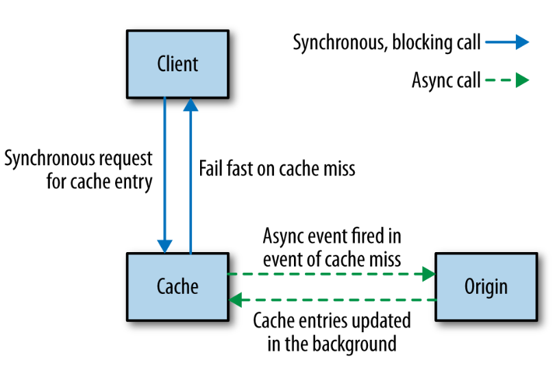

# Microservices at Scale

What happens when we have to handle failure of multiple separate services or manage hundreds of services?

## Failure Is Everywhere

[The network is unreliable](https://en.wikipedia.org/wiki/Fallacies_of_distributed_computing), hard disks are unreliable too. The problem is: **failure becomes a statistical certainty at scale**.

You should spend a bit less of your time trying to stop the inevitable, and a bit more of your time dealing with it gracefully. This means developing **antifragile systems**, just like Netflix and Amazon are doing.

## How Much Is Too Much?

Services may have different cross-functional requirements. Usually these come from users but you can ask them specific questions to gain the information you need.

When it comes to considering if and how to scale out your system to better handle load or failure, start by understanding the following requirements:

- Response time/latency
- Availability
- Durability of data

Once you have these requirements in place, you’ll want a way to systematically measure them on an ongoing basis.

## Architectural Safety Measures

There are a few patterns that we can make use of to ensure that if something does go wrong, it doesn’t cause nasty ripple-out effects.

- Put **timeouts** on all out-of-process calls, and pick a default timeout for everything. Log when timeouts occur, look at what happens, and change them accordingly.
- Use **circuit breakers**. With a circuit breaker, after a certain number of requests to the downstream resource have failed, the circuit breaker is blown. All further requests fail fast while the circuit breaker is in its blown state. After a certain period, the client sends a few requests through to see if the downstream service has recovered, and if it gets enough healthy responses it resets the circuit breaker.
- In shipping, a **bulkhead** is a part of the ship that can be sealed off to protect the rest of the ship. So if the ship springs a leak, you can close the bulkhead doors. You lose part of the ship, but the rest of it remains intact.  
This concept can be adopted in software by *isolating components*. Circuit breakers can be used as an automatic mechanism to seal a bulkhead.
- **Isolation**. The more one service depends on another being up, the more the health of one impacts the ability of the other to do its job.
- In **idempotent operations**, the outcome doesn’t change after the first application, even if the operation is subsequently applied multiple times. This is very useful when we want to replay messages that we aren’t sure have been processed, a common way of recovering from error.

## Scaling

We scale our systems in general for one of two reasons: safety and performance. Let’s look at some common scaling techniques and think about how they apply to microservice architectures:

- Prefer **horizontal scaling** to vertical scaling because the former adds resilience too and is more cost-efficient.
- **Split workloads** across different hosts as it increases resiliency by reducing failure impact area. It also makes it easier to scale instances. You can even split a single microservice into multiple host if there are parts with critical workloads.
- **Spread the risk** by ensuring that multiple hosts are spread on different physical machines. Or spread on multiple datacenter regions.
- Put multiple instances of a single microservice behind a **load balancer**. This allow us to add more instances of our microservice in a way that is transparent to any service consumers. Also, we can place *SSL termination* at this level.
- Use **worker-based systems** to share load and reduce fragility of operations.
- The need to change our systems to deal with scale isn’t a sign of failure. It is a sign of success. SO don't plan ahead for handling massive loads.

## Scaling Databases

What if we are storing data in a database? We’ll need to know how to scale that too.

Straight off, it is important to separate the concept of *availability of the service* from the *durability of the data* itself.

### Scaling for Reads

In a relational database management system (RDBMS), data can be copied from a primary node to one or more replicas. This is often done to ensure that a copy of our data is kept safe, but we can also use it to distribute our reads, while writes are made to the master database.

### Scaling for Writes

A common approach when scaling for writes is to use **sharding**. With sharding, you have multiple database nodes. You take a piece of data to be written, apply some hashing function to the key of the data, and based on the result of the function learn where to send the data.

Benefits:

- Writes are scaled on multiple *shards*.

Downsides:

- Difficult to handle queries involving multiple *shards*.
- Usually, no resiliency is added since data is not replicated between shards.

### CQRS

The Command-Query Responsibility Segregation (CQRS) pattern refers to an alternate model for storing and querying information: part of the system deals with commands, which capture requests to modify state, while another part of the system deals with queries.

The command and query parts of our system could live in different services, or on different hardware, and could make use of radically different types of data store. This can unlock many ways to handle scale.

## Caching

Caching is a commonly used performance optimization whereby the previous result of some operation is stored, so that subsequent requests can use this stored value rather than spending time and resources recalculating the value.

THere are 3 models of caching:

- In **client-side caching**, the client stores the cached result. This drastically reduces network load but it's tricky to write a good cache invalidator and changes to the caching strategy need to be rolled out to every client.
- With **proxy caching**, a proxy is placed between the client and the server. This is often a very simple way to add caching to an existing system. The additional network hops are worth the cost.
- WIth **server-side caching**, the server handles the cached results. Everything is opaque to the client but network calls continue to be made.

### Caching in HTTP

HTTP provides some really useful controls to help us cache:

- We can use **cache-control** directives to tell client whether to cache the resource at all.
- An **ETag** is used to determine if the value of a resource has changed. This becomes powerful when using a *conditional GET*: it allows us to retrieve only modified data.

### Caching for writes

By using a **write-behind cache**, you can write to a local cache, and at some later point the data will be flushed to a downstream source.

This can be useful when you have bursts of writes, or when there is a good chance that the same data will be written multiple times.

### Caching for Resilience

Caching can be used to implement resiliency in case of failure. With client-side caching, if the downstream service is unavailable, the client could decide to simply use cached but potentially stale data.

### Hiding the origin

With a normal cache, if a request results in a cache miss, the request goes on to the origin to fetch the fresh data with the caller blocking, waiting on the result. But, if we suffer a massive cache miss, many requests will hit the origin.
One way to protect the origin in such a situation is to use asynchronous cache filling:

### Keep it simple

The more caches between you and the source of fresh data, the more stale the data can be, and the harder it can be to determine the freshness of the data that a client eventually sees.

## Autoscaling

There are different approaches to autoscaling:

1. You could have the scaling of your services triggered by well-known trends that emerged form gathered data.
2. You could be reactive, bringing up additional instances when you see an increase in load or an instance failure, and remove instances when you no longer needed them.
3. A combination of the previous two.

Being reactive and predictive can help you be very cost-efficient if you're on a pay-per-use platform.

## CAP Theorem

In a distributed system, we have 3 properties available: consistency, availability and partition tolerance. The theorem states that we get to keep only 2 of them. You can read the proof [here](https://mwhittaker.github.io/blog/an_illustrated_proof_of_the_cap_theorem/).

### Sacrificing Consistency

In a failure situation, sacrificing consistency means that if we keep accepting writes then at some point in the future they have to be resynchronized. The longer the partition lasts, the more difficult this resynchronization can become.

In reality, even with a functioning network, replication of data is not instantaneous because of network latency. Systems that go with AP are called **eventually consistent**.

### Sacrificing Availability

If we really need consistency, then we need to sacrifice availability. But how to achieve consistency in a distributed system?
I want to read a record from the local database node. I have to go and ask the other node if the record it's up to date. But I also have to ask that database node to not allow it to be updated while the read completes; this means I need to initiate a transactional read across multiple nodes to ensure consistency. Transactional reads are make the system very slow.

In CP systems, tradeoffs can be made (e.g. instead of asking every node in the network, we may be satisfied by asking half the nodes in the network if a record is up to date).

### Sacrificing Partition Tolerance

This isn't an option, since systems operating over a network absolutely need partition tolerance.

### AP or CP?

AP systems are simpler to build and scale more easily, while CP systems require more work to support distributed consistency.

In our systems, we can actually have a mix of both for different services, depending on business requirements.

## Service discovery

Service discovery includes activities such as: knowing what is running in a given environment, knowing which APIs are available, etc.
There are different solutions available. Our ideal solution should cope well with constantly creating and destroy services in an environment.

### DNS

DNS lets us associate a name with the IP address of one or more machines. There are multiple approach for picking services' names:

- **Templates that includes environment**, e.g. *[servicename]-[environment].mysytem.com*.
- **Environment-agnostic naming**, e.g. *[servicename].mysytem.com*, which resolves to the different hosts in different environments. This requires more work than the previous approach.

Advantages:

- Well understood standard, has support in every technology stack.

Disadvantages:

- Few DNS services (e.g. Amazon's Route53) are suitable for dealing with highly disposable hosts.
- Subject to cache poisoning because DNS entries have a *time to live* (TTL).

Registering a DNS entry only for a load balancer, which keeps track of a cluster of services of the same type, partially helps against the disadvantages.

### Dynamic Service Registries

The limitations of DNS in a dynamic environment have led to alternative systems:

- [Zookeeper](http://zookeeper.apache.org/), a centralized service for maintaining configuration information, naming, providing distributed synchronization, and providing group services.
- [Consul](https://www.consul.io/), a distributed service mesh to connect, secure, and configure services across any runtime platform and public or private cloud.
- [Eureka](https://github.com/Netflix/eureka), a REST based service that is primarily used in the AWS cloud for locating services for the purpose of load balancing and failover of middle-tier servers.

It's also important to have visualizations helpful to humans trying to understand the state of the system.

## Documenting Services

So we know where our APIs are, but we should also know what's their format and what they do. Some helpful tools for documentation:

- [Swagger](https://swagger.io/) lets you describe your API in order to generate a web UI that allows you to view the documentation and interact with the API via a web browser.
- [HAL](http://stateless.co/hal_specification.html) is a standard that describes standards for hypermedia controls that we expose. The HAL Browser is similar to Swagger's UI.