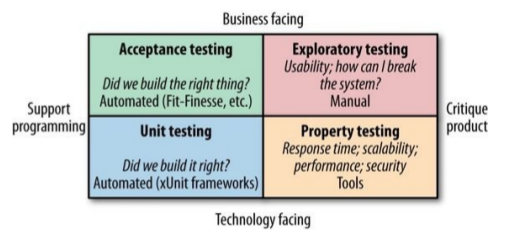

# Testing

Distributed systems add complexity in automated tests too.

## Types of Tests

Tests can be categorized by the following diagram:

In microservices, the amount of manual tests should be kept at a minimum in order to reduce test times. Also, since there are no significant difference in manual testing, we will examine how automated testing changes from monolithic systems to microservices systems.

## Test scope

The Test Pyramid is a model proposed by Mike Cohn to associate the ideal amount of tests to each test scope.

Note that terms like *service* and *unit* in this context are ambiguous and we will refer to the *UI* layer as *end-to-end* tests.

As we go up the pyramid our confidence increases but we reduce the ability to pinpoint bug causes and have a slower feedback.

Ideally, you want test of **different scopes for different purposes** (e.g. you can catch an integration bug with an e2e test and then you can keep it covered with a unit test).

How many tests? It's better to increase the number of tests as you go down the pyramid. Doing the opposite has the potential to keep your build *red* for long times.

### Unit Tests

They typically test a single function or method call in isolation (i.e. without starting services or using external resources such as network connectivity).

Done right, they can be very fast. You could run a lot of them in less than a minute.

These are *technology-facing* tests that will help us catch the most bugs and guide us through code restructuring thanks to their fast feedback and reliability.

Unit tests are also more easier to be implemented than other tests.

### Service Tests

They are designed to bypass the user interface and test services directly.

In monolithic systems, a group of classes that provide a certain service to users can be tested together.

In microservices, we need to isolate the service we want to test so that we are able to quickly find the root cause of a bug. To achieve this isolation, we need to stub out other services interacting with the one under test.
But note that while a **stubbed service** does not care if it's called 1 or 100 times, a **mocked service** can provide you with that information so you could write more solid tests. The downside is that mocked services can make your tests brittle because of the magnitude of details tested.

So after our service tests pass we are confident that the new microservice is ready to contact other microservices with no errors. But what about other microservices calling the one we want to deploy?

### End-to-End Tests

They are run against the whole system, so they cover a lot of code and give you a lot of confidence that the system will work in production.
On the other hand, it's harder to diagnose an issue that comes up in e2e tests.

These tests are tricky to deal with, suppose we add them at the end of our deploy pipeline:

Then we have 2 issues:

1. Which services version are we going to use in our tests?
2. Executing such a pipeline for each microservice is going to be really inefficient.

Both of them are solved with a *fan in* model:

But there are other disadvantages when using e2e tests:

- As the scope increases, we might face more errors due to **causes unrelated to the behavior we want to test** (e.g. network failures).
- When tests fail *sometimes* because of unrelated issues (these are called **flaky tests**), people will tend to re-run them without any effort to understand the errors. This will cause lots of scheduled builds and lead to a broken system because some issues (e.g. concurrency issues) may slip through this process as unrelated issues. Flaky tests will also cause a [normalization of deviance](https://en.wikibooks.org/wiki/Professionalism/Diane_Vaughan_and_the_normalization_of_deviance) in the test system, so it's mandatory to remove them (or temporarily disable them to apply a fix) as soon as they're spotted.

#### Ownership

Usually the tests of a service are owned by the team developing the service. But in e2e tests there can be multiple services involved in a single test.

Avoid:

- A **free for all** approach, because no team would have a real ownership of any test, causing failing tests to be ignored or easily dismissed as responsibility of another team.
- A **test team** whose job is solely to write e2e tests. A team like this would not know how to fix issues caught in tests and would cause the development team to become distant from the tests of their code.

Instead aim to share responsibilities between the teams involved in each single test: everyone should be able to add a new test and it must be clear who is responsible for the success of that test.

#### Speed

When e2e tests are too slow:

- They are more prone to unrelated issues happening during their execution, this makes them brittle tests.
- The feedback cycle is slowed, so it takes more time to fix a failing build. This will cause builds to pile up: we will no longer able to quickly deploy small features.

Things can be sped up by running tests in parallel, but it can only help to a certain extent.

To speed up your e2e tests, you should aim to remove useless tests and weigh risk/rewards of implemented tests to determine if they're worth having around. But this is a really difficult task since humans are not that good at estimating risks.

#### The Metaversion

After running e2e tests one can start thinking, *So, I know all these services at these versions work together, so why not deploy them all together?*.
This reasoning is to avoid because it usually leads to a proposal of a unified version number for the system, which in turn leads to coupling deploys. In the end, it will lead to a microservices system without the benefits of microservices.

#### Test Journeys, Not Stories

Despite the disadvantages, e2e test can be doable with one or two services. So what if we have 20 services?

Avoid:

- Adding an e2e for each story to implement because it leads to slow feedback times and huge overlaps in test coverage.

Instead, you should test on a small number of core journeys. Any functionality not covered in these journeys needs to be covered in tests that analyze services in isolation from each other.

### Consumer-Driven Tests

We use e2e to be sure that when a new service is deployed the system will keep working. Another way to approach this problem is by defining *consumer-driven contracts (CDC)*, which express the expectations of the consumers of a service.

These tests can be run in isolation and are at the *service* test scope, although they serve a different purpose from classic service tests: we are able to identify breaking changes and decide whether to introduce breaking changes in the involved consumer service too or think through it before deploying the new service.

The major benefit is that these tests are not as expensive as e2e tests, while they give us confidence that the new service does not break the expectations of its consumers.

Consumer-driven tests can be implemented by the teams developing consumer services but this requires a good communication channel between the teams. If for some reason it's hard to communicate, they can be written by the team developing the new service.

## Testing after production

Most testing is done before the system is in production. Still, when the system is in production:

- Some bugs may have slipped through our tests.
- New failure modes are discovered.
- Our users use the system in ways we could never expect.

One reaction to this is often to define more and more tests. However, at a certain point we have we will hit diminishing returns with this approach.

### Separating Deployment from Release

If we deploy the system in an environment prior to directing production loads against it, we are able to detect issues specific to the environment.

In this environment we can also run **smoke tests** to make sure that the deploy was successful and there are no environmental issues.

There are different practices that you can adopt to follow this approach.

#### Blue/Green deployment

With blue/green deployment we have two copies of our software deployed at a time, but only one version of it is receiving real requests.

This diagram describes how blue/green deployment works:

Benefits:

- Smoke tests can be run after the deploy.
- If we keep the old version running, we can quickly fallback to it if we detect errors in the new version. The *detect and revert* can be automated too.
- Zero downtime between deploys can be achieved.

Downsides:

- Requires some networking engineering but usually cloud providers support the needed functionalities.

#### Canary Releasing

With canary releasing, we verify our newly deployed service by directing amounts of production traffic against it to see if it performs as expected.

Performance can be measured the way you prefer, some examples are:

- Measuring response times.
- Measuring error rates.
- Measuring sales conversions of a new recommendation algorithm.

When considering canary releasing, you need to decide if you are going to divert a portion of production requests to the canary or just copy production load.

Benefits:

- Has all the benefits provided by blue/green deployment.
- Lets you evaluate the performance of the new service according to custom/complex metrics.

Downsides:

- More difficult to setup than blue/green deployment.
- Needs advanced network routing capabilities.
- May need more computing power because of multiple services that have to run together for long times.

#### MTBF vs MTTR

By using techniques such as blue/green and canary deployment we acknowledge that some issues can only be discovered in production: sometimes expending the same effort into getting better at remediation of a release can be significantly more beneficial than adding more automated tests.
This is referred to as the trade-off between optimizing for **mean time between failures** (*MTBF*) and **mean time to repair** (*MTTR*).

For different organizations, this trade-off between MTBF and MTTR will vary, and much of this lies with understanding the true impact of failure in a production environment.

## Cross-Functional Testing

*Nonfunctional requirements* describe those characteristics your system exhibits that cannot simply be implemented like a normal feature. We will use the term **cross-functional requirements** *(CFR)* instead to refer to these tests.

As example, these are "popular" CFRs:

- Latency of a web server.
- Maximum concurrent users.
- How secure the stored data should be.

Tests around CFRs should follow the pyramid too: some tests will have to be end-to-end (e.g. load tests) but others won’t (e.g. tests to catch performance bottlenecks).

It's really important to consider CFRs from the start of the development process, because they shape too the design of your system.

### Performance Tests

Performance tests are a way of ensuring that some of our CFRs can be met.

In microservices systems performance is critical since what would be a single database call in a monolithic system could now become 3-4 calls to different services.

As with functional tests, you may want different performance tests for each test scope.

Due to the time it takes to run performance tests, it isn’t always feasible to run them on every check-in. It is a common practice to run a subset every day, and a larger set every week.

Also, it's important to have targets so that the results of these tests can be correctly interpreted and evaluated (they may mark a build as failed is the performance level is below a certain threshold).

## Summary

Fundamental notions:

- Optimize for fast feedback, and separate types of tests accordingly.
- Avoid the need for end-to-end tests wherever possible by using consumer-driven contracts.
- Use consumer-driven contracts to provide focus points for conversations between teams.
- Try to understand the trade-off between putting more efforts into testing and detecting issues faster in production (optimizing for MTBF versus MTTR).
