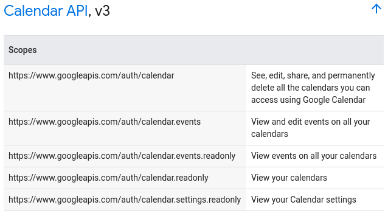
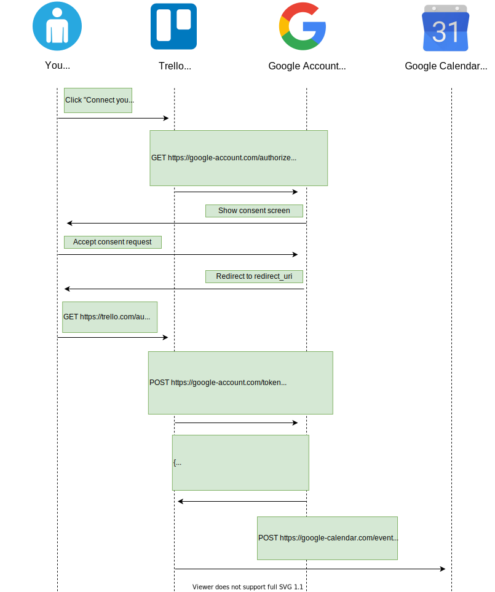
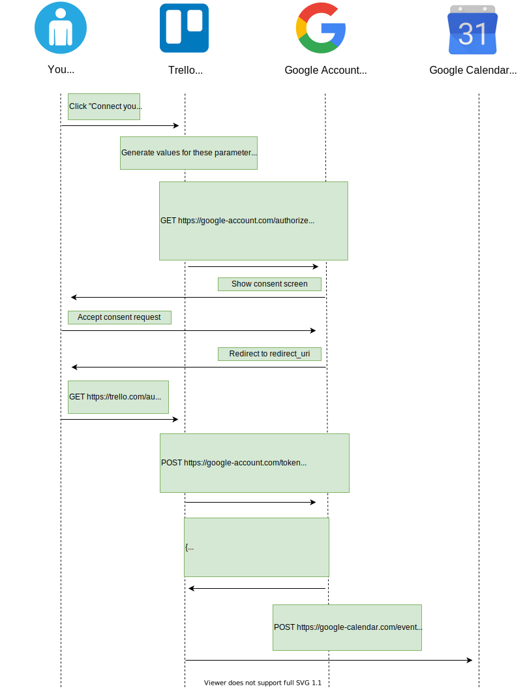
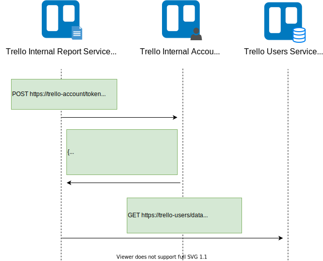
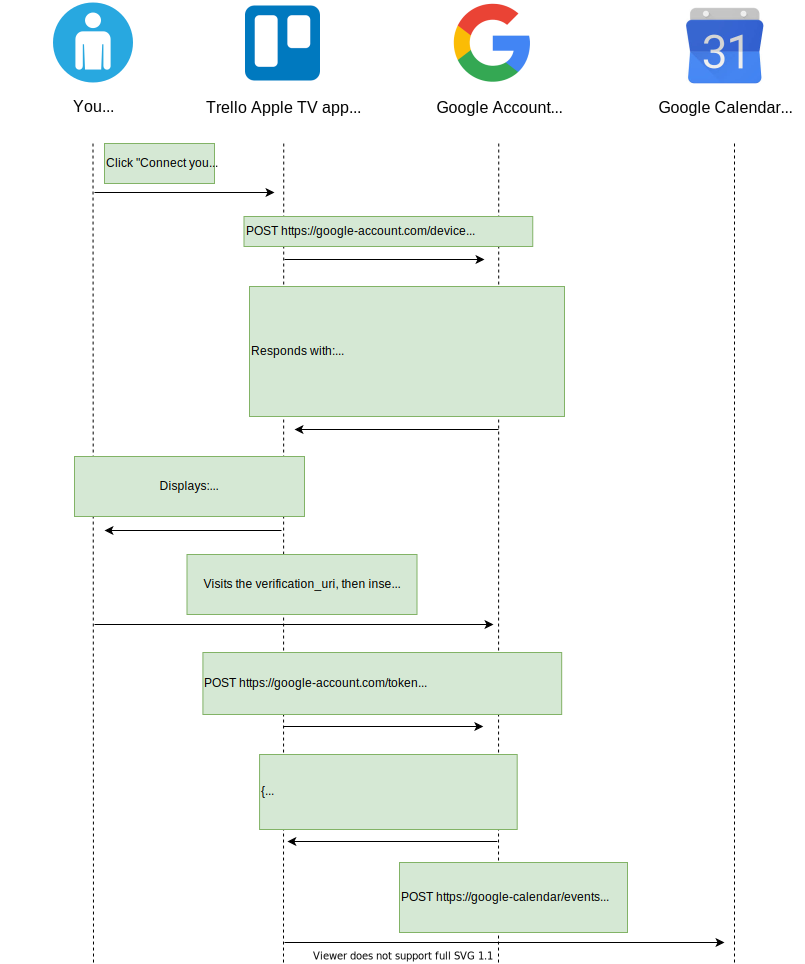
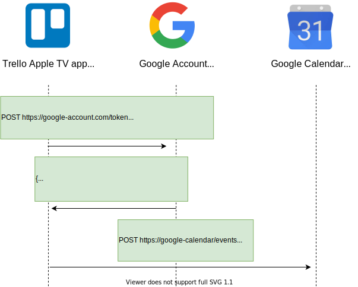
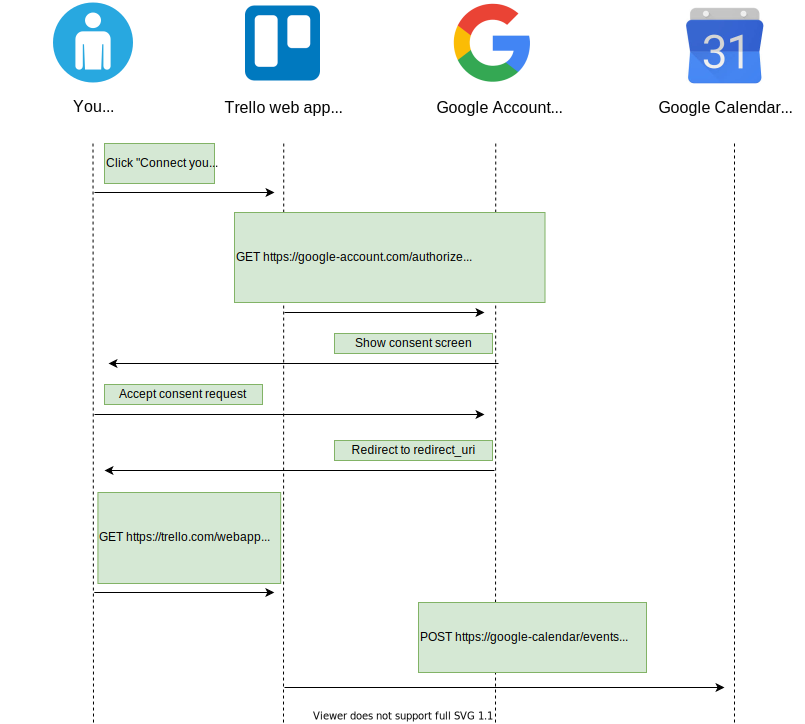

# OAuth 2.0

OAuth 2.0 is an open _framework_ that allows to securely obtain __authorization__ to access resources via HTTP.

For example, you can tell Google that Trello is allowed to access your Google Calendar in order to associate tasks with dates, _without sharing your Google password with Trello_. This is possible because Trello can send OAuth 2.0 tokens to Google which prove your consent.

OAuth 2.0 is not considered to be a _protocol_ because the [specification](https://tools.ietf.org/html/rfc6749) is rather vague. In fact, this is one of the reasons why Eran Hammer [resigned](https://hueniverse.com/oauth-2-0-and-the-road-to-hell-8eec45921529) from his role of lead author for OAuth 2.0.

In the following sections we will go through the main concepts of the OAuth 2.0 framework.

## Purpose

One of the best analogies is to consider an OAuth 2.0 token to be the __valet key__ to your car. By using the valet key, the valet can start and move (for a limited distance) your car but he can't access the trunk.

An OAuth 2.0 token serves the same purpose of the valet key. As a resource owner, you decide which data each consumer is allowed to access from your service providers. You can give each consumer a different valet key, while being sure that none of these consumers has access to your full key or to any data from which they can build a full key.

## Roles

Roles identify the _actors_ that can participate in OAuth 2.0 flows. There are 4 roles:

- **Resource Owner**: the user who is giving authorization to access his account information.
- **Client**: the application that attempts to get access to the user's account. It needs the user's permission in order to get this access.
- **Authorization Server**: the server that allows users to approve or deny an authorization request.
- **Resource Server**: the server that consumes the user's information.

This is how OAuth 2.0 roles would be translated in our example:

{: class="center"}

## Endpoints

Endpoints are URIs that define the location of authorization services. In OAuth 2.0, there are 3 endpoints:

- The **Authorization endpoint** is on the authorization server. It's used for the resource owner's log in and grants authorization to the client application.
- The **Redirect endpoint** is on the client application. The resource owner is redirected to this endpoint after having granted authorization at the authorization endpoint.
- The **Token endpoint** is on the authorization server. This is where the client application exchanges some secret information for an access token.

Note that some OAuth 2.0 grants don't involve all these endpoints but just some of them.

This is how the OAuth 2.0 endpoints would be translated in our Trello example:

{: class="center"}

## Scopes

Scopes can be used to limit a client's access to the user's resources. Basically:

1. A client can request one or more scopes.
2. The requested scopes are presented to the user in the consent screen.
3. If the user gives his consent, the access token issued to the application will be limited to those scopes.

The OAuth 2.0 specification does not define any specific values for scopes, since they are highly dependent on the service provider. For example, these are the scopes for the Google Calendar's API:

{: class="center"}

## Grants

Authorization grants are methods for a client to get an __access token__. The access token proves that a client has the permission to access the user's data.

Authorization grants are also known as _flows_.

OAuth 2.0 recommends to use one of the following grants:

- [Authorization code](#authorization-code-grant)
- [Authorization code with PKCE](#proof-key-for-code-exchange-pkce)
- [Client credentials ](#client-credentials-grant)
- [Device authorization](#device-authorization-grant)
- [Refresh token](#refresh-token-grant)

But there are also some grants whose usage is discouraged by the [OAuth 2.0 Security Best Current Practice document](https://tools.ietf.org/html/draft-ietf-oauth-security-topics-13):

- [Implicit grant](#implicit-grant)
- [Password grant](#password-grant-grant)

### Authorization code grant

The [Authorization code grant](https://tools.ietf.org/html/rfc6749#section-1.3.1) has been designed for clients which can securely store a client secret. This grant is typically used when the client is a web server.

Here's how the Authorization code grant would work in our Trello example:

{: class="center"}

1. The user clicks on a button in the Trello's web app in order to connect his Google account to Trello.
2. The Trello web app requests an authorization code. This operation can be done in several ways (e.g. redirection, link on HTML button). The code can be retrieved by making a HTTP GET request to the Google account's _authorization_ endpoint with these parameters:
    - **client_id**: the public id of the client. This was determined by the authorization server when the client was registered.
    - **response_type**: specifies the grant type. By setting this parameter to _code_, the client indicates that it wants to start an authorization code grant.
    - **state**: used to prevent [CSRF attacks](#authorization-code-csrf).
    - **redirect_uri**: this is where the user will be sent after he approves the permission request.
    - **scope**: describes the scope of the authorization (optional).
3. The Google account server responds with the consent screen page.
4. The user examines the requested permissions in the consent screen and then gives consent to Trello.
5. The Google account server redirects the user to the *redirect_uri* on the client with these parameters:
    - **code**: the authorization code.
    - **state**: the state that was previously set for this authorization request.
6. Trello now has the authorization code and exchanges it for the access token to the user's Google account by making a HTTP POST request:
    - **code**: the authorization code.
    - **grant_type**: specifies the grant type. By setting this parameter to *authorization_code*, the client indicates that it wants to complete an authorization code grant.
    - **redirect_uri**: the uri where the authorization code has been previously sent.
    - **client_id**: the public id of the client. This was determined by the authorization server when the client was registered.
    - **client_secret**: the private secret stored by the client. It was associated by the authorization server to the *client_id* when the client was registered.
7. Trello uses the access token to create an event in the user's Google Calendar.

You can try the Authorization code grant in the [OAuth.net playground](https://www.oauth.com/playground/authorization-code.html).

#### Proof Key for Code Exchange (PKCE)

[PKCE](https://tools.ietf.org/html/rfc7636) extends the Authorization code grant to securely perform the code exchange with clients that cannot privately store the _authorization code_. This technique can be applied to any client, although it's typically used when the client is a mobile or a web browser application.

Here's how the Authorization code grant with PKCE would work in our Trello example:

{: class="center"}

1. The user clicks on a button in the Trello's web app in order to connect his Google account to Trello.
2. The Trello web app generates a **code verifier** (i.e. a cryptographically secure random string) and the respective **code challenge**, which can be an hash of the code verifier or the code verifier itself. This code must be saved in the web app for later use.
3. The Trello web app requests an authorization code. This operation can be done in several ways (e.g. redirection, link on HTML button). The code can be retrieved by making a HTTP GET request to the Google account's _authorization_ endpoint with these parameters:
    - **client_id**: the public id of the client. This was determined by the authorization server when the client was registered.
    - **response_type**: specifies the grant type. By setting this parameter to _code_, the client indicates that it wants to start an authorization code grant.
    - **state**: used to prevent [CSRF attacks](#authorization-code-csrf).
    - **redirect_uri**: this is where the user will be sent after he approves the permission request.
    - **scope**: describes the scope of the authorization (optional).
    - **code_challenge**: used to send the code challenge previously generated by the Trello web app.
    - **code_challenge_method**: if it's set to _S256_, indicates that the code verifier will be hashed with SHA256 and then base64-url-encoded into the code challenge. Otherwise, the secret code will be used as the code challenge.
4. The Google account server responds with the consent screen page.
5. The user examines the requested permissions in the consent screen and then gives consent to Trello.
6. The Google account server redirects the user to the *redirect_uri* on the client with these parameters:
    - **code**: the authorization code.
    - **state**: the state that was previously set for this authorization request.
7. Trello now has the authorization code and exchanges it for the access token to the user's Google account by making a HTTP POST request:
    - **code**: the authorization code.
    - **grant_type**: specifies the grant type. By setting this parameter to _code_, the client indicates that it wants to complete an authorization code grant.
    - **redirect_uri**: the uri where the authorization code has been previously sent.
    - **client_id**: the public id of the client. This was determined by the authorization server when the client was registered.
    - **code_verifier**: the code verifier that was initially generated by the Trello client. Google Account will check whether it matches the challenge that was specified by Trello in the authorization request. If an attacker intercepted the authorization code, it won't be able to exchange it for an access token.
8. Trello uses the access token to create an event in the user's Google Calendar.

You can try the Authorization code grant with PKCE in the [OAuth.net playground](https://www.oauth.com/playground/authorization-code-with-pkce.html).

### Client credentials grant

The [Client credentials grant](https://tools.ietf.org/html/rfc6749#section-4.4) is used when clients need to be authorized to act on behalf of a *service account* rather than a human user.

For example, let's suppose that Trello has a system-internal service that computes statistics about users to create some reports. In order to do so, the Report service needs to be authorized to read the Trello users' data.
Here's how the client credentials grant would work in this example:

{: class="center"}

1. The Report service requests the access token that represents its service account by making a HTTP POST request:
    - **grant_type**: specifies the grant type. By setting this parameter to *client_credentials*, the client indicates that it wants to complete a client credentials grant.
    - **client_id**: the public id of the client. This was determined by the authorization server when the client was registered.
    - **client_secret**: the private secret stored by the client. It was associated by the authorization server to the *client_id* when the client was registered.
2. The Report service uses the access token to read the Trello users' data.

### Device authorization grant

The [Device authorization grant](https://tools.ietf.org/html/rfc8628) has been designed for devices with limited input capabilities.

For example, let's suppose we are using a Trello app for Apple TV and you want to authorize the app to access your Google Calendar's data.
Here's how the device authorization grant would work in this case:

{: class="center"}

1. The user clicks on a button in the Trello's web app in order to connect his Google account to Trello.
2. The Trello app requests a device code with a HTTP POST request to the _device_ endpoint on the authorization server:
    - **client_id**: the public id of the client. This was determined by the authorization server when the client was registered.
3. The authorization server responds with the requested data:
    - **device_code**: a code representing the device, to be later displayed to the user.
    - **user_code**: a code representing the user, to be later displayed to the user.
    - **verification_uri**: represents the URL the user must visit to enter the user_code and device_code.
    - **interval**: the minimum amount of time in seconds that the client should wait between polling requests to the token endpoint.
    - **expires_in**: the lifetime in seconds of the device_code and user_code. (optional)
4. The Trello app displays a message to the user, instructing him to visit the verification_url and the insert the user_code and device_code.
5. The user visits the verification_uri, then approves the authorization request by inserting the user_code and device_code.
6. While the Trello app was waiting for the user to approve the authorization request, it was polling the token endpoint with an HTTP POST request:
    - **grant_type**: set this parameter to *urn:ietf:params:oauth:grant-type:device_code* to complete a device authorization grant.
    - **client_id**: the public id of the client. This was determined by the authorization server when the client was registered.
    - **device_code**: a code representing the device.
7. After the user approved the request, the token endpoint responds with the access token.
8. The Trello app uses the access token to create an event in the user's Google Calendar.

You can try the Device authorization grant in the [OAuth.net playground](https://www.oauth.com/playground/device-code.html).

### Refresh token grant

The [Refresh token grant](https://tools.ietf.org/html/rfc6749#section-1.5) has been designed to exchange a _refresh token_ for an expired access token.

Here's how this grant would work in our Trello example:

{: class="center"}

1. Trello requests the authorization server to refresh an expired token with a HTTP POST request:
    - **grant_type**: set this parameter to *refresh_token* to request a token refresh.
    - **refresh_token**: refresh token. This token was initially returned by the authorization server alongside the access token.
    - **client_id**: the public id of the client. This was determined by the authorization server when the client was registered.
    - **client_secret**: the private secret stored by the client. It was associated by the authorization server to the *client_id* when the client was registered. This parameter can be omitted if the client does not have a client secret.
2. The token endpoint responds with the new access token. The response may not contain a new refresh token, meaning that the existing refresh token is still valid.
3. The Trello app uses the new access token to create an event in the user's Google Calendar.

### Implicit grant

The [Implicit grant](https://tools.ietf.org/html/rfc6749#section-1.3.2) has been designed to immediately return an access token to the client, without first performing a code exchange.

This grant was the recommended choice for native and JavaScript applications. But now **its usage is discouraged** because returning access tokens in a HTTP redirect brings several [security risks](#implicit-grant-security-risks) to your application. These kinds of applications should instead use the Authorization code flow with PKCE.

Here's how the Implicit grant would work in our Trello example:

{: class="center"}

1. The user clicks on a button in the Trello's web app in order to connect his Google account to the Trello web app.
2. The Trello web app requests the token by making a HTTP GET request to the Google account's _authorization_ endpoint with these parameters:
    - **client_id**: the public id of the client. This was determined by the authorization server when the client was registered.
    - **response_type**: specifies the grant type. By setting this parameter to _token_, the client indicates that it wants to use the implicit grant.
    - **state**: used to prevent attackers from crafting redirect URLs with malicious tokens.
    - **redirect_uri**: this is where the user will be sent after he approves the permission request.
    - **scope**: describes the scope of the authorization (optional).
3. The Google account server responds with the consent screen page.
4. The user examines the requested permissions in the consent screen and then gives consent to the Trello web app.
5. The Google account server redirects the user to the *redirect_uri* on the client. This URL uses the hash character (*#*) to specify parameters so that they are not sent to the server. These are the parameters received by the client:
    - **access_token**: the OAuth 2.0 access token.
    - **token_type**: set to *Bearer* to indicate that the access token must be used with the Bearer scheme.
    - **expires_in**: the lifespan of the access token.
    - **scope**: describes the scope of the authorization (optional).
    - **state**: the state that was previously set for this authorization request. The client needs to verify this match before using the access token to avoid malicious token injections.
7. The Trello web app uses the access token to create an event in the user's Google Calendar.

### Password grant

The [Password grant](https://tools.ietf.org/html/rfc6749#section-1.3.3) has been designed to exchange the user's credentials for an access token. Since the client needs to read the password in cleartext, this grant should not be used at all. This is also stated in the latest [OAuth 2.0 Security Best Current Practice](https://tools.ietf.org/html/draft-ietf-oauth-security-topics-13#section-3.4).

### Which grant should you use?

Now we understand which are the the grant types in the OAuth 2.0 specification.

So, _which grant should you use for your application_? The following flow chart answer this question:

{: class="center"}

## Vulnerabilities and Attacks

There are some known attacks that can exploit vulnerable implementations of OAuth 2.0. In this section we will go through some of the most known OAuth 2.0 attacks.

### Phishing with fake consent screens

In some OAuth 2.0 grants, the user is redirected to a consent screen (e.g. the Google consent screen). How can the user be sure that he's actually dealing with a legitimate consent screen?
Some malicious apps may exploit this mechanism to make the user input his credentials in a fake, carefully crafted consent screen.

### Authorization Code CSRF

If applications don't use and validate _state_ parameters they can be vulnerable to different types of attacks.

Let's suppose that Trello doesn't validate _state_ parameters. Then, a malicious party would be able to carry out this [CSRF](https://en.wikipedia.org/wiki/Cross-site_request_forgery) attack:

1. Alice visits the Trello app and clicks on the button to authorize access to Google Calendar.
2. Trello redirects Alice's browser to Google Account, requesting a redirect back to itself once Alice approves the authorization request.
3. Alice is redirected to the Google Account, where she enters her credentials in order to authorize access to the Trello application.
4. After a successful login, Alice prevents the subsequent redirect request and saves its URL (i.e. the callback URL with an authorizaiton code).
5. Alice somehow gets Bob to visit the redirect URL. Bob may already be logged in to Trello with his account.
6. Bob clicks the link to Trello and the authorization code is exchanged for an access token. If Bob is logged in then Trello may associate Bob's account with Alice's access token.
7. Now if Bob links a date to an item on his Trello account, Alice will be able to see that in her Google Calendar interface.

In reality, Trello maintains and validates a _state_ parameter. This means Trello would reject such requests even if Bob would inadvertently click on the URL sent by Alice.

### Implicit grant security risks

As of today, OAuth 2.0 discourages usage of the Implicit grant because of the following security risks:

- [Lack of confidentiality for access tokens](https://tools.ietf.org/html/rfc6749#section-10.3)
- [Misuse of access token to impersonate resource owner](https://tools.ietf.org/html/rfc6749#section-10.16)

## More resources

If you want to learn more about OAuth 2.0, you can consult these resources:

- [Aaron Parecki's blog](https://aaronparecki.com/oauth-2-simplified)
- [OAuth 2.0 Simplified, by Aaron Parecki](https://oauth2simplified.com/)
- [OAuth.net Playground](https://www.oauth.com/playground/)
- [Getting Started with OAuth 2.0, on Pluralsight](https://app.pluralsight.com/library/courses/oauth-2-getting-started/table-of-contents) 