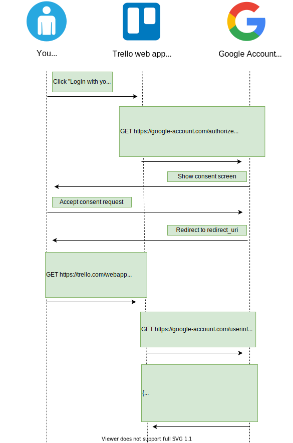
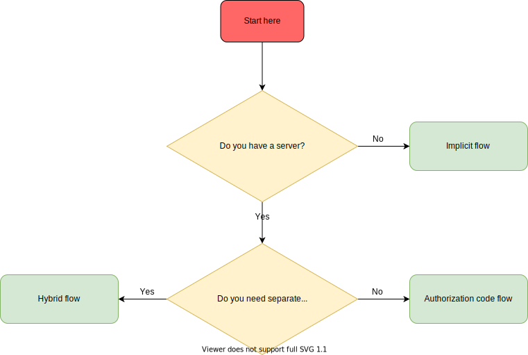

# OpenID Connect

OpenID Connect (*OIDC*) is an authentication protocol. It builds upon [OAuth 2.0](./oauth2.md) and [JSON Web Tokens](./openid-connect.md) to provide users one login for multiple sites.

For example, Trello lets you create a new account using an existing Google account. In this case, Trello only needs to access some basic information of your Google account (e.g. email and username). The main advantage is that *you don't need to share your Google password with Trello*. This is possible because Trello can use OpenID Connect tokens to validate your Google account identity.

In the following sections we will go through the main concepts of the OpenID Connect protocol.

## Purpose

Sometimes you need only an authentication mechanism, without any authorization logic. But OAuth 2.0 is not good enough by itself to be used for authentication. Let's see why by examining how authentication could be implemented with OAuth 2.0:

We could use a custom OAuth 2.0 [scope](./oauth2.md#scopes) named *signin* that represents the permission to access the basic information of the user. The idea is: _if the user is able to grant us that token, then surely he must have authenticated_. But there are some problems with this approach:

- The authentication step made by the user is not correlated to the authorization request.
- The user data endpoint is usually different for each service (e.g. Google may have a different endpoint from Facebook).

In fact, this usage of OAuth 2.0 is vulnerable to a very simple yet dangerous impersonification attack: if a malicious application has been granted access to your user data, it can reuse the same *access_token* to authenticate as you to another service (e.g. e-banking) using the same authentication mechanism.

With this approach, providers using OAuth 2.0 for authentication would need to implement extra security measures. But this measure may not be standardized across different providers! This means software developers would need to write different code to authenticate to different providers.

So, in order to make OAuth 2.0 suitable for authentication we need:

- A new token type which can be validated in a standardized way.
- A standardized mechanism to access the user's information.

This is exactly what OpenID Connect provides on top of OAuth 2.0, with the help of JWT.

## Endpoints

Endpoints are URIs that define the location of authentication services. In OpenID Connect, there are 3 endpoints:

- The Authorization endpoint is usually on the authorization server. It's used to perform authentication of the user.
- The Token endpoint is usually on the authorization server. This is where the client application exchanges some secret information for an access token, [ID token](#id-tokens) and optionally a refresh token.
- The UserInfo endpoint is usually on the authorization server. It's used to retrieve claims about the currently authenticated user.

This is how the OpenID Connect endpoints would be translated in our Trello example:

{: class="center"}

## Scopes

OAuth 2.0 scopes in OpenID Connect are used to define to which [ID token](#id-tokens) claims the client is requesting access.

The OpenID Connect specification defines a set of [standard scopes](https://openid.net/specs/openid-connect-core-1_0.html#ScopeClaims). The only required scope is *openid*, which states that the client intends to use the OpenId Connect protocol.

## Id Tokens

ID Tokens are JWTs introduced by OpenID Connect that contain identity data. An ID Token can be returned in a token response, alongside an *access_token*. It can be consumed by the application and it also contains user information (e.g. username, email).

The OpenID Connect specification defines a set of [standard claims](https://openid.net/specs/openid-connect-core-1_0.html#StandardClaims). Still, it's possible to define custom claims and add them to your tokens.

## Flows

The OpenID Connect specification defines 3 authentication flows:

- [Authorization code flow](#authorization-code-flow)
- [Implicit flow](#implicit-flow)
- [Hybrid flow](#hybrid-flow)

### Authorization code flow

The [Authorization code flow](https://openid.net/specs/openid-connect-core-1_0.html#CodeFlowAuth) has been designed for clients which can securely store a client secret. This grant is typically used when the client is a web server.

Here's how the Authorization code flow would work in our Trello example:

{: class="center"}

1. The user clicks on a button in the Trello's web app in order to login with his Google account to Trello.
2. The Trello web app requests an authorization code. This operation can be done in several ways (e.g. redirection, link on HTML button). The code can be retrieved by making a HTTP GET request to the Google account's _authorization_ endpoint with these parameters:
    - **client_id**: the public id of the client. This was determined by the authorization server when the client was registered.
    - **response_type**: specifies the grant type. By setting this parameter to _code_, the client indicates that it wants to start an authorization code flow.
    - **state**: used to prevent [CSRF attacks](./oauth2.md#authorization-code-csrf).
    - **redirect_uri**: this is where the user will be sent after he approves the permission request.
    - **scope**: describes the scope of the authorization. By setting this parameter to _openid+..._, the client specifies that it intends to start an OpenID Connect authorization code flow.
3. The Google account server responds with the consent screen page.
4. The user examines the requested permissions in the consent screen and then gives consent to Trello.
5. The Google account server redirects the user to the *redirect_uri* on the client with these parameters:
    - **code**: the authorization code.
    - **state**: the state that was previously set for this authentication request.
6. Trello now has the authorization code and exchanges it for the access token and ID token for the user's Google account by making a HTTP POST request:
    - **code**: the authorization code.
    - **grant_type**: specifies the grant type. By setting this parameter to *authorization_code*, the client indicates that it wants to complete an authorization code grant.
    - **redirect_uri**: the uri where the authorization code has been previously sent.
    - **client_id**: the public id of the client. This was determined by the authorization server when the client was registered.
    - **client_secret**: the private secret stored by the client. It was associated by the authorization server to the *client_id* when the client was registered.
7. Trello now [validates](./jwt#how-to-validate-a-jwt) the ID token. If the validation succeeds, Trello can be sure that the token it received was actually intended for its client. This solves the impersonification attack we've discussed [earlier](#purpose).
8. If Trello needs more user information than the one included in the Id token, it can contact the UserInfo endpoint on the authorization server.
9. The UserInfo endpoint on the authorization server responds in a standardized format.

### Implicit flow

The [Implicit flow](https://openid.net/specs/openid-connect-core-1_0.html#ImplicitFlowAuth) has been designed to immediately return an access token to the client, without first performing a code exchange.

It is mainly used by web browser applications without a server. The Access Token and ID Token are returned directly to the client, which may expose them to the user and other applications that have access to the client.

Here's how the Implicit flow would work in our Trello example:

{: class="center"}

1. The user clicks on a button in the Trello's web app in order to login with his Google account to Trello.
2. The Trello web app requests the ID token. It can be retrieved by making a HTTP GET request to the Google account's _authorization_ endpoint with these parameters:
    - **client_id**: the public id of the client. This was determined by the authorization server when the client was registered.
    - **response_type**: specifies the grant type. By setting this parameter to *id_token+token*, the client indicates that it wants to start an OpenID Connect Implicit flow that returns an ID token and an access token.
    - **state**: used to prevent [CSRF attacks](./oauth2.md#authorization-code-csrf).
    - **redirect_uri**: this is where the user will be sent after he authenticates.
    - **scope**: describes the scope of the authorization. By setting this parameter to _openid+..._, the client specifies that it intends to start an OpenID Connect authorization code flow.
    - **nonce**: associates a client session with an ID token in order to mitigate [replay attacks](#replay-attack). It's a mandatory parameter in the OpenID Connect implicit flow.
3. The Google account server responds with the consent screen page.
4. The user examines the requested permissions in the consent screen and then gives consent to Trello.
5. The Google account server redirects the user to the *redirect_uri* on the client. This URL uses the hash character (*#*) to specify parameters so that they are not sent to the server. These are the parameters received by the client:
    - **access_token**: the OAuth 2.0 access token.
    - **id_token**: the OpenID Connect ID token.
    - **token_type**: set to *Bearer* to indicate that the access token must be used with the Bearer scheme.
    - **expires_in**: the lifespan of the access token.
    - **state**: the state that was previously set for this authorization request. The client needs to verify this match before using the access token to avoid malicious token injections.
6. The Trello web app now [validates](./jwt#how-to-validate-a-jwt) the ID token. Also, the value of the _nonce_ claim must be checked to verify that it is the same value as the one that was sent in the authentication request. If the validation succeeds, the Trello web app can be sure that the token it received was actually intended for its client. This solves the impersonification attack we've discussed [earlier](#purpose).
7. If the Trello web app needs more user information than the one included in the Id token, it can contact the UserInfo endpoint on the authorization server.
8. The UserInfo endpoint on the authorization server responds in a standardized format.

### Hybrid flow

The [Hybrid flow](https://openid.net/specs/openid-connect-core-1_0.html#HybridFlowAuth) combines mechanisms of the [Authorization code flow](#authorization-code-flow) and [Implicit flow](#implicit-flow). It allows the front end and back end of the application to receive their own tokens, with their own scopes.

The Hybrid flow has three possible variations. To use a specific variation, set the *response_type* parameter to one of these values:

- *code id_token*
- *code token*
- *code id_token token*

These notes won't contain the details of the Hybrid flow because it's rarely used in practice.

### Which flow should you use?

Now we understand which are the the available flows in the OpenID Connect specification.

So, _which flow should you use for your application_? The following flow chart answer this question:

{: class="center"}

## Vulnerabilities and attacks

There are some known attacks that can exploit vulnerable implementations of OpenID Connect. In this section we will go through some of the most known OpenID Connect attacks.

### Replay attack

When we're using the OpenID Connect Implicit flow in a web browser app without server, the _nonce_ parameter is a fundamental security measure.

Let's suppose that, in our example, the Trello web app is not using a nonce parameter. Here's a [replay attack](https://en.wikipedia.org/wiki/Replay_attack) that can be carried out in this situation:

1. The Trello web app redirects the user to the authentication server with a *response_type* of *id_token*.
2. The user authenticates and gives his consent.
3. Google Account redirects the user back to the Trello web app with an *id_token*.
4. An attacker is able to get the response URL in some way (e.g. via packet sniffing).
5. The attacker pastes the response URL into their browser's URL bar, effectively authenticating as the original user.

Instead, a canonical implementation of OpenID Connect would mandate handling the nonce in this way:

1. The Trello web app generates a cryptographically secure random nonce and stores in clear text, for example in the browser's local storage.
2. The Trello web app hashes the nonce and sends the hash as the value of the *nonce* parameter in the authentication request.
3. When the Trello web app receives the authentication response, it reads and then removes the nonce from the persistent storage, hashes it, and compares it against the hashed nonce in the id_token. If they don't match, then the client application refuses to establish identity.

By using the nonce, even if the attacker intercepts the response, he would still need the clear-text nonce to authenticate with the Trello web app.

## More resources

If you want to learn more about OpenID Connect, you can consult these resources:

- [OpenID Foundation's website](https://openid.net/)
- [Comprehensive list of OpenID Connect specifications](https://openid.net/developers/specs/)